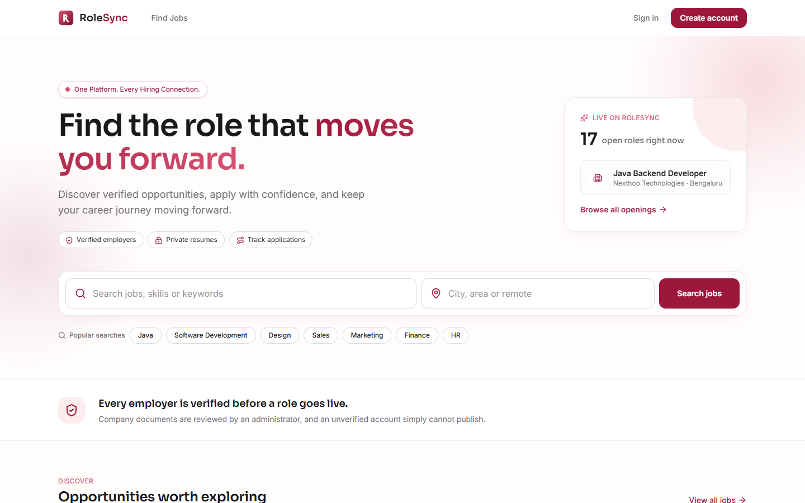
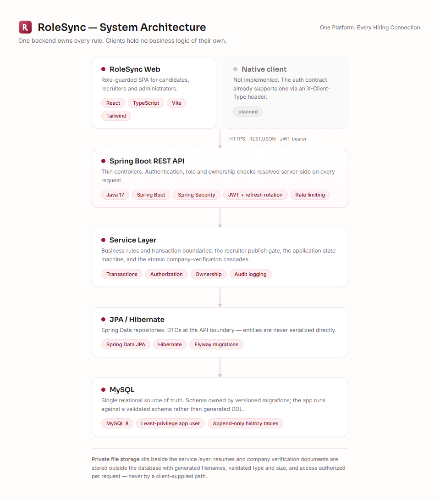
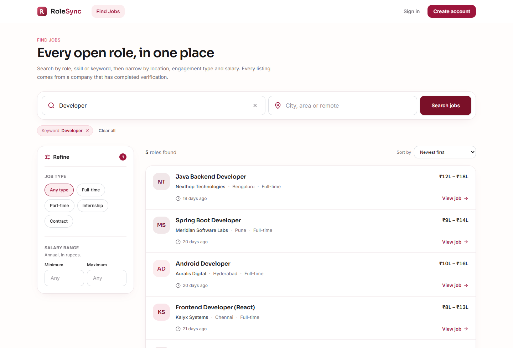
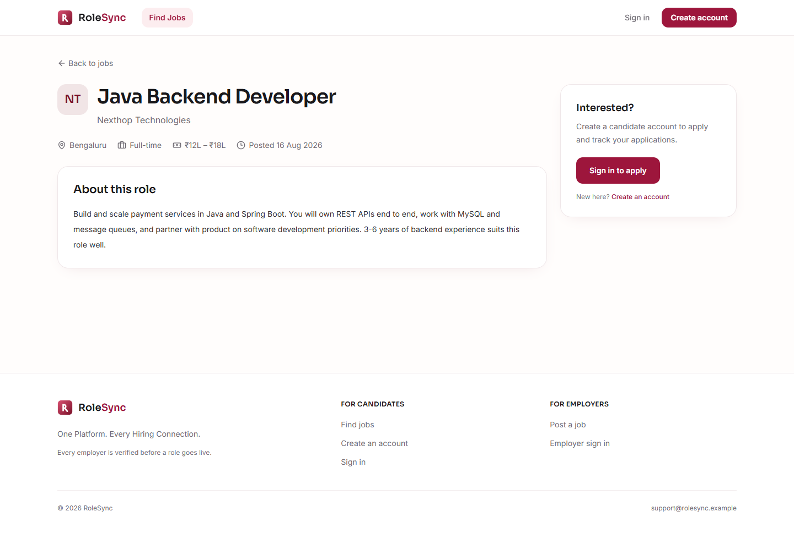
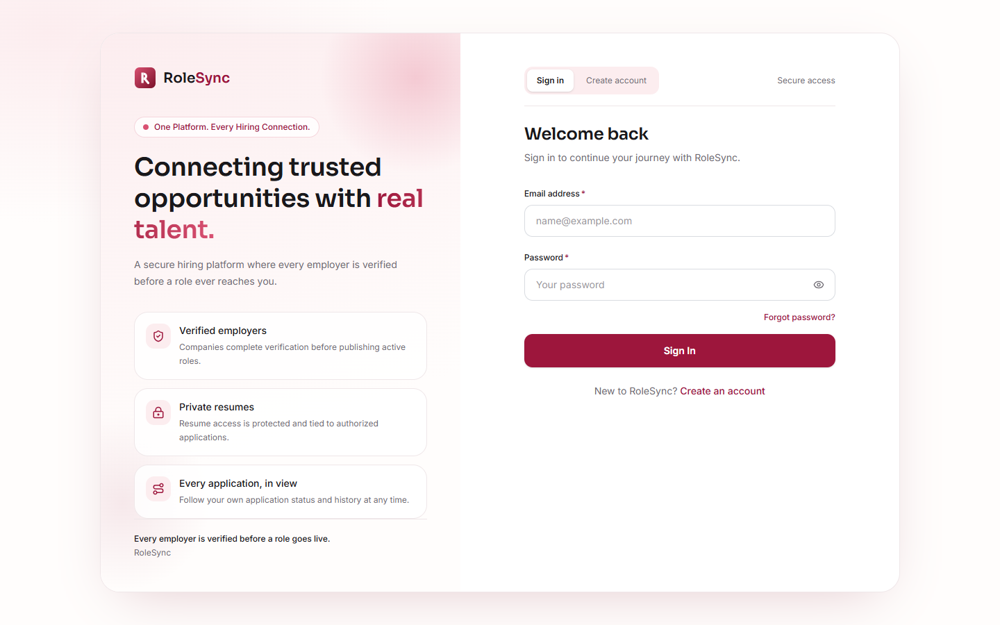
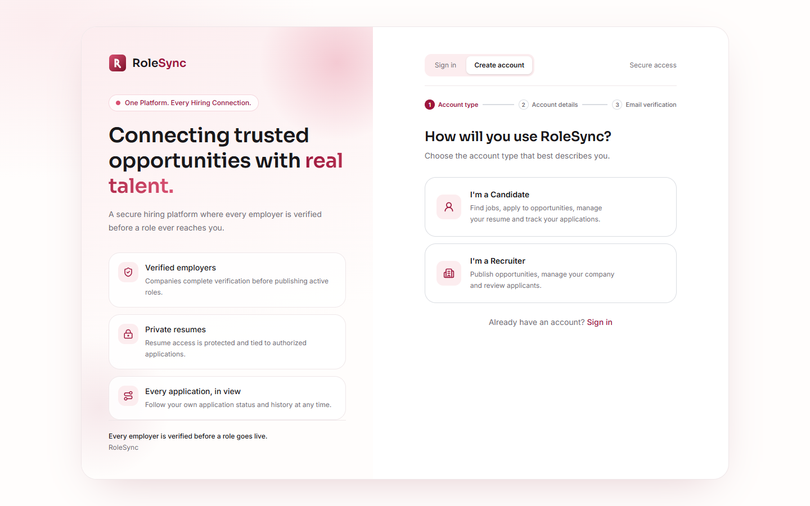
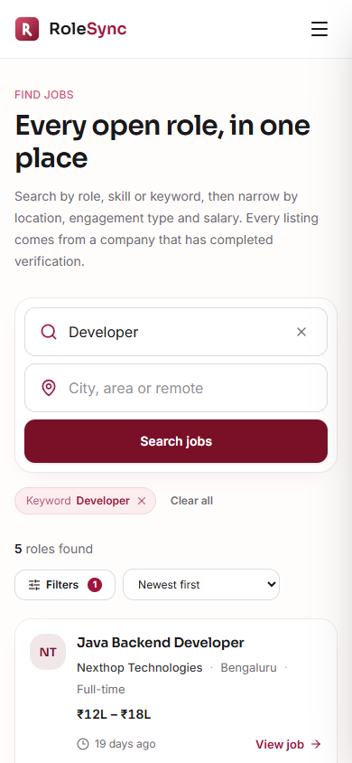

<div align="center">
  

  # RoleSync

  ### One Platform. Every Hiring Connection.

  **Full-Stack Recruitment Platform**

  
  
  
  
  
  
</div>



---

## Overview

RoleSync is a full-stack, role-based recruitment platform that connects three kinds of user
through one backend and one database:

- **Candidates** — build a profile, upload a resume, search and filter jobs, apply, and track
  every application through its status pipeline.
- **Recruiters / Companies** — register a company, pass an administrator-reviewed verification
  step, publish jobs, review applicants and move applications through the hiring stages.
- **Administrators** — review company verification submissions, moderate users and jobs, and
  read an append-only audit log of every consequential action.

The design principle throughout is that **one backend owns every rule**. The web client is a
client: it holds no business logic of its own, and no client-side decision is ever
authoritative. Authorization, ownership and every state transition are resolved on the server
from the authenticated identity.

## Problem Statement

Small job boards tend to fail in the same two places, and RoleSync is built around both.

**Anyone can post a job.** Without a verification step a job board fills with listings from
unverified companies, and a candidate has no way to tell which employer is real. RoleSync puts
an administrator-reviewed verification gate in front of publishing, and re-checks it on every
publish request rather than once at signup.

**Applications disappear into silence.** A candidate applies and never learns what happened.
RoleSync models the application lifecycle as an explicit, server-controlled state machine with
an append-only history, so the status a candidate sees is the status the recruiter actually
set — never a stale guess, and never a transition invented by the client.

## Product Scope

| Area | What it covers |
|---|---|
| **Identity & access** | Registration, email OTP verification, sign-in, password reset, session handling across three roles |
| **Candidate workspace** | Profile, resume management, job search and filtering, applications, status history |
| **Recruiter workspace** | Company profile, verification document submission, job lifecycle, applicant review, status transitions |
| **Administration** | Verification review, user moderation, job and application moderation, audit log |
| **Platform** | REST API contract, private file storage, rate limiting, security headers, migration-owned schema |

## User Roles

### Candidate

- Register with email and password; verify the address by one-time code
- Maintain a profile with skills, education and experience
- Upload a resume — validated on type and size, stored privately under a generated filename
- Search jobs by keyword, location, engagement type and salary range, with pagination
- View a job, including whether they have already applied to it
- Apply once per job, enforced at both the database and service layers
- Track each application and its full status history

### Recruiter / Company

- Register and verify contact details, then create a company profile
- Submit company verification documents; each submission is kept as a new reviewable record
  rather than overwriting the previous round
- Publish a job **only** while account status, contact verification and company verification
  are all satisfied — read live from the database on every publish
- Create, edit, activate and deactivate jobs
- Review applicants for their own jobs only, with ownership resolved server-side
- Move applications through the hiring pipeline

### Admin

- Sign in through a role with no public registration route
- Review company verification submissions: approve, reject, or request a resubmission
- Suspend and reactivate users
- Moderate jobs and applications
- Read an append-only audit log covering every consequential action

## Key Features

**Authentication & accounts** — BCrypt password hashing · email OTP contact verification with
expiry, attempt caps and resend cooldown · short-lived access tokens with rotating refresh
tokens · password reset that does not reveal whether an email is registered

**Candidate** — profile · resume upload and private storage · job search with filters and
pagination · job detail with existing-application state · application list and status history

**Recruiter** — company profile · verification document submission · job create/edit/activate/
deactivate behind the publish gate · per-job applicant lists · pipeline status transitions

**Admin** — dashboard · verification review · user management · job and application moderation
· audit log

**Platform** — role-based authorization on every endpoint · object-ownership checks · REST API
with proper verbs and status codes · pagination caps · global error handling that never leaks
internals · responsive UI

### Rules worth calling out

- A recruiter may publish an active job only while **all three** of account status, contact
  verification and company verification hold — read live from the database on every publish,
  never from a token claim or a cached flag.
- Editing a verification-sensitive company field while approved sends the company back for
  re-review **and** deactivates its live jobs, in one atomic transaction.
- Restoring a suspended company is a separate transaction that never touches job rows.
  Bringing a job back is always a later, explicit recruiter action, re-checked against the
  full publish gate.
- An application permanently keeps the resume it was submitted with. A later upload never
  rewrites history a recruiter has already acted on.

## Architecture



```
        RoleSync Web (React / Vite)
                    │
                    │  HTTPS · REST/JSON · JWT bearer
                    ▼
          Spring Boot REST API
        (authentication, authorization)
                    │
                    ▼
              Service Layer
     (business rules, transactions, ownership)
                    │
                    ▼
             JPA / Hibernate
                    │
                    ▼
                  MySQL
```

Controllers are thin and handle HTTP only. Services own business logic, transaction
boundaries, and every authorization and ownership check. DTOs are used at the API boundary so
entities are never serialized directly — a password hash or token hash cannot leak through a
response by accident. Schema changes are owned by versioned migrations; the application runs
against a validated schema rather than generating DDL.

**There is no Android or iOS client in this project.** The authentication contract already
accommodates one — a client-type header decides whether the refresh token is returned in an
HttpOnly cookie or in the response body — but no native client has been built.

## Technology Stack

**Backend** — Java 17 · Spring Boot 3.5 · Spring Security · Spring Data JPA / Hibernate ·
Flyway · MySQL 8 · Maven · JUnit 5, Mockito, AssertJ

**Frontend** — React 19 · TypeScript · Vite · Tailwind CSS · React Router · React Hook Form
with Zod · oxlint

Deliberately excluded: Kafka, Redis, Elasticsearch, Kubernetes, GraphQL, microservices. The
project is one deployable backend and one web client, and nothing in the scope justified more.

## Security

Implemented and covered by tests. This is a description of controls in the codebase, not a
claim of assurance — see the caveat at the end of this section.

- **Passwords** — BCrypt hashing, with a policy enforced server-side and mirrored client-side
  only as a convenience.
- **Tokens** — short-lived access tokens carrying minimal claims. Refresh tokens are long
  random opaque values stored **only as a hash**, with mandatory rotation on every refresh and
  reuse detection that revokes the entire token family. Raw access tokens are never persisted.
- **Web token storage** — access token in memory, refresh token in an HttpOnly + Secure +
  SameSite cookie, kept first-party by serving the API same-origin.
- **CSRF** — double-submit cookie applied to the two cookie-authenticated endpoints. Every
  other endpoint requires an explicit `Authorization` header, which a browser never attaches
  on its own, so it is not CSRF-exposed.
- **OTP** — cryptographically generated, stored hashed, single-use, expiring, attempt-capped,
  with a resend cooldown. Never logged, never returned in any API response.
- **Authorization** — role checks *and* object-ownership checks resolved from the
  authenticated identity on every protected endpoint. Frontend route guards are UX only.
- **Rate limiting** — fixed-window counters on registration, sign-in, OTP request and verify,
  password reset, and both upload paths.
- **File uploads** — MIME and extension validation, size caps, generated filenames,
  executables rejected, private storage, short-lived signed access. A client-supplied storage
  path is never treated as authorization.
- **HTTP headers** — a Content-Security-Policy with no `unsafe-eval` and no `unsafe-inline`
  for scripts in the production policy, plus `nosniff`, `Referrer-Policy`, `X-Frame-Options`
  and a restrictive `Permissions-Policy`.
- **Forwarded headers** — client-IP trust is **off by default** and must be enabled
  explicitly, so a request header cannot influence rate-limit keys unless a real proxy is
  known to front every request.
- **Error handling** — a global exception handler; stack traces, SQL and internal class names
  never reach a response body.
- **Database** — least-privilege application user; constraints enforced at the schema level,
  not only in code.

> This project has **not** been independently penetration-tested, security-audited or
> certified. The controls above are implemented and test-covered; that is a different and
> weaker claim than "secure".

## Testing & QA

> **Backend test suite: 299 tests passed with 0 failures and 0 errors.**

Verified by running `mvn clean test` against the current commit, and re-verified from a fresh
clone of the private repository.

| Check | Result |
|---|---|
| Backend suite | 299 tests, 0 failures, 0 errors |
| Frontend lint | clean |
| Frontend build | succeeds |
| Fresh-clone verification | clone → install → lint → build → full backend suite, all passing |
| Browser QA | 5 public routes checked live: correct title and favicon, no broken images, no unexpected console errors |
| Responsive | no horizontal page overflow at 320 / 390 / 768 / 1024 / 1440 px |

Coverage is not only the happy path. The suite includes duplicate-application rejection,
invalid status transitions, cross-role access attempts, suspended-account behaviour,
unverified-recruiter publish attempts, refresh-token rotation and reuse detection, OTP expiry
and brute-force limits, unauthorized resume and verification-document access, invalid file
types, oversized uploads, and ownership-violation attempts on every recruiter resource.

Integration tests run against a dedicated test database, guarded so a test context pointed
anywhere else aborts — a test run cannot touch development data. Each run applies the
migrations from scratch, which re-verifies the migration chain against an empty schema as a
side effect.

## Responsive Design

Built mobile-first against a fixed token scale — typography, spacing, radius, shadow — defined
once and consumed as both CSS custom properties and utility classes, so the two cannot drift
apart.

Layouts were checked at **320, 390, 768, 1024 and 1440 px**. Wide content such as tables,
applicant lists and filter rows scrolls inside its own container rather than forcing the page
to scroll horizontally, which is the failure mode that breaks dashboards on small screens.

## Engineering Highlights

- **Contract-first API design** — roughly 40 endpoints specified with request/response shapes,
  enums and per-endpoint error codes before implementation, so the client and server were
  built against one agreed document.
- **Database design** — versioned migrations, a deliberate constraint and index strategy, and
  history modelled as append-only tables rather than mutable rows.
- **Non-trivial transactional work** — the two company-verification cascades each commit a
  status change, every affected job deactivation and all resulting audit entries atomically,
  while the inverse operation is deliberately a *different*, narrower transaction.
- **Concurrency correctness** — the one-application-per-job rule is enforced by a database
  unique constraint *and* a service check, because neither alone is sufficient.
- **Security hardening pass** — a self-audit produced findings that were each fixed and
  covered by a regression test: branding leaking into transactional email, silently discarded
  exceptions, unevicted rate-limiter entries, a non-constant-time CSRF comparison, unsafe
  forwarded-header trust, and a missing production CSP.
- **Frontend engineering** — role-guarded routing, a typed API client, form validation
  mirroring server rules, and real loading / empty / error / 401 / 403 states rather than
  happy-path-only screens.
- **Release engineering** — explicit file selection for publication, secret scanning across
  the full commit history, and fresh-clone build verification before release.

## Screenshots

Captured from the application running locally against a synthetic dataset. These are real
screens, not mockups.

### Landing page


### Job search with filters
Keyword search with engagement-type and salary filters, applied result chips, and pagination.


### Job detail
Full role detail with the company, engagement type, salary range and posting date.


### Sign in
Split-panel authentication shell shared by sign-in and registration.


### Registration — account type
Step one of three: the platform asks which role is being created before collecting anything.


### Mobile — job search at 390px


> **Not shown:** the candidate, recruiter and administrator dashboards. All three are
> implemented, but capturing them requires signing in with real account credentials, so no
> screenshot of them is published here. Mockups have deliberately not been substituted.

## Architecture Diagram

Full-resolution diagram: [`docs/architecture.png`](docs/architecture.png)

## Workflows

The three role journeys, the publish gate, the verification cascades and the application state
machine are documented in [`docs/workflows.md`](docs/workflows.md).

## Demo

Deployment and demo status: [`demo/demo-link.md`](demo/demo-link.md)

There is no live hosted deployment. No credentials of any kind are published in this
repository.

## Repository Access

> **Source code is maintained in a private repository. This public repository is a project
> showcase containing documentation, architecture, workflows and screenshots.**

No backend, frontend, configuration or database source is published here. Access to the
private implementation repository can be arranged on request for interviews or technical
review.

## Known Limitations

Stated plainly, because a portfolio project that claims to be finished is less credible than
one that knows what it is.

- **Not production-deployed.** No live environment, no configured object storage, no
  production domain, no CI pipeline. Deployment steps are designed, not executed.
- **No backup/restore verification.** A backup policy is specified but has never been restored
  and tested, so it does not count as a verified control.
- **Rate limiting is in-process.** Fixed-window counters in application memory: correct for a
  single instance, but it does not survive horizontal scaling. The trade-off is recorded
  rather than hidden.
- **Registration is synchronous.** If the verification email fails to send, the whole
  registration transaction rolls back. There is no retry queue; the user retries.
- **No skills-based job filter.** The backend exposes none, so the UI offers no control for
  one rather than faking it.
- **No public company profile page.** Job listings show the company name as text, because no
  endpoint backs a company page.
- **Interim cookie policy.** `SameSite=Lax` rather than `Strict`, pending a decision on the
  final frontend/backend domain layout.
- **No native mobile client.** Scoped and supported by the API contract, but not built.
- **Not security-audited.** No independent penetration test or third-party review.

## Future Improvements

- Native Android candidate client against the existing API
- Saved jobs and email alerts for new matching listings
- Skills-based search backed by a real index
- Distributed rate limiting and a queue for outbound email
- Public company profile pages
- A CI pipeline running the full suite on every push, and a tested backup/restore drill

---

<div align="center">
  <strong>RoleSync</strong> — One Platform. Every Hiring Connection.
</div>
